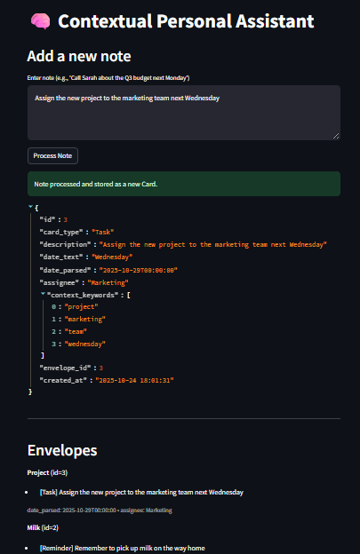

# 🧠 Contextual Personal Assistant – AI Agentic Framework

This project implements an AI-powered agentic framework that ingests, organizes, and structures user notes into actionable “Cards” such as Tasks, Reminders, and Ideas. It demonstrates autonomous knowledge management, modular architecture, and future-ready reasoning capabilities.

## 🚀 Project Overview

The goal of this project was to design a personal assistant that can:

1. Understand natural language notes entered by a user.
2. Classify each note into **Task**, **Reminder**, or **Idea**.
3. Extract key entities such as **dates**, **people**, **teams**, and **contextual keywords**.
4. Organize notes into **Envelopes** based on context and semantic similarity.
5. Provide a foundation for proactive reasoning and recommendations through a separate **Thinking Agent**.

This demonstrates a full **agentic AI workflow**: **Ingestion → Structuring → Storage → Contextual Reasoning**.

## 🧩 Ingestion & Organization Agent (Implemented)

The core of the project is the **Ingestion & Organization Agent**, which processes freeform notes into structured cards.

**Key Components:**

- **LLM & Prompt Management:**

  - **LangChain** orchestrates structured prompt templates.
  - **HuggingFace GPT-2** runs locally, providing cost-effective and low-latency text classification and extraction.

- **Entity Extraction:**

  - **SpaCy (`en_core_web_md`)** detects PERSON entities, ORG, and proper nouns.
  - **Regex patterns** identify dynamic team names (e.g., "Team A", "Team 1").
  - **Dateparser** parses both absolute and relative dates ("next Monday", "tomorrow").

- **Context Management:**

  - `ContextManager` groups notes into **Envelopes** representing themes or projects.
  - Prevents duplicate cards and tracks envelope relevance using keyword and semantic similarity scoring.

- **Storage:**

  - **SQLite database** stores Cards and Envelopes persistently.
  - Enables structured queries and future extension to multi-user systems.

- **User Interface:**

  - **Streamlit** provides a simple frontend for note entry, card visualization, and envelope exploration.
  - Supports session state to maintain agent and database objects between interactions.

**Technical Highlights:**

- Hybrid extraction (SpaCy + regex) ensures robust detection of people, teams, and key terms.
- Semantic similarity and contextual keyword boosting assign notes to the most relevant envelope automatically.
- Lightweight local models ensure zero API costs and fast prototyping.

## 🧠 Thinking Agent (Planned Implementation)

A **Thinking Agent** is designed as the next stage of this framework. While it is not yet implemented, the architecture has been fully planned.

**Design Goals:**

- **Proactive Recommendations:** Suggest next steps, highlight overlapping tasks, and propose new envelopes when ideas cluster.
- **Conflict Detection:** Identify duplicate or conflicting deadlines across tasks and suggest resolution.
- **Cross-Envelope Reasoning:** Correlate multiple envelopes to provide insights about project progress.

**Technical Approach:**

- **LLM Framework:** LangChain or LlamaIndex for structured reasoning and prompt orchestration.
- **Model Selection:** Local HuggingFace models (e.g., GPT-2 or small transformers) for offline reasoning; scalable to GPT-4 or other APIs for richer reasoning.
- **Data Aggregation:** Reads all historical Cards, Envelopes, and context from SQLite to ensure comprehensive analysis.
- **Scheduling:** Runs periodically (e.g., hourly) or on-demand without affecting real-time ingestion.
- **Output:** Structured JSON containing recommendations, conflict alerts, and suggested envelope updates.

## Thinking Agent (Planned Implementation)

```
              ┌───────────────────────────┐
              │   Scheduled Trigger /     │
              │   Manual Execution        │
              └─────────────┬─────────────┘
                            │
                            ▼
              ┌───────────────────────────┐
              │ Fetch All Cards &         │
              │ Envelopes from SQLite DB  │
              └─────────┬─────────────────┘
                        │
                        ▼
          ┌───────────────────────────────┐
          │ Preprocessing & Normalization │
          │ - Standardize dates           │
          │ - Clean textual content       │
          │ - Resolve entity references   │
          └─────────────┬─────────────────┘
                        │
                        ▼
          ┌───────────────────────────────┐
          │ Conflict & Overlap Detection  │
          │ - Duplicate tasks             │
          │ - Conflicting deadlines       │
          │ - Assignee overlaps           │
          └─────────────┬─────────────────┘
                        │
                        ▼
          ┌───────────────────────────────┐
          │ Cross-Envelope Reasoning      │
          │ - Find related envelopes      │
          │ - Suggest merging / splitting │
          │ - Identify idea clusters      │
          └─────────────┬─────────────────┘
                        │
                        ▼
          ┌───────────────────────────────┐
          │ Proactive Recommendation      │
          │ Generation                    │
          │ - Next steps                  │
          │ - Priority suggestions        │
          │ - New envelope proposals      │
          └─────────────┬─────────────────┘
                        │
                        ▼
          ┌──────────────────────────────┐
          │ Structured JSON Output       │
          │ - Recommendations            │
          │ - Conflict alerts            │
          │ - Suggested envelope updates │
          └─────────────┬────────────────┘
                        │
                        ▼
          ┌───────────────────────────────┐
          │ Update Database / Notify UI   │
          │ - Optionally flag conflicts   │
          │ - Store recommendations       │
          └───────────────────────────────┘

```

**Rationale for Choices:**

- Offline, local LLMs reduce cost while supporting multi-step reasoning.
- Structured prompt chains enforce consistency and prevent ambiguous outputs.
- SQLite ensures the reasoning agent works on the same dataset as the ingestion agent, maintaining modularity and simplicity.

## ⚙️ Setup & Running Instructions

**1. Environment Setup**

```bash
# Create virtual environment
python -m venv .venv
# Activate
# Windows
.\.venv\Scripts\activate
# Linux/Mac
source .venv/bin/activate

# Install dependencies
pip install -r requirements.txt

# Validate SpaCy model
python -m spacy validate
python -m spacy download en_core_web_sm
```

**2. Running the Streamlit App**

```bash
streamlit run app.py
```

**Usage:**

- Enter a note, e.g., `"Call Sarah about the Q3 budget next Monday"`.
- The agent classifies it, extracts entities, and assigns it to the correct envelope.
- Cards and envelopes are stored in SQLite and displayed in the frontend.



**Example Output:**

```
{
"id": 1,
"description": "Call Sarah about the Q3 budget next Monday",
"card_type": "Task",
"date_text": "Monday",
"date_parsed": "2025-10-27T00:00:00",
"assignee": "Sarah",
"context_keywords": [
"sarah",
"q3",
"budget",
"monday"
],
"envelope_id": 1
}
```

## 🟢 Ups & Achievements

- **Modular Architecture:** Clear separation of ingestion, extraction, context, and storage modules.
- **Reliable LLM Integration:** LangChain + HuggingFace pipeline provides robust classification and extraction.
- **Hybrid Entity Extraction:** SpaCy + regex ensures proper detection of people, teams, and keywords.
- **Context-Aware Envelope Assignment:** Semantic similarity and contextual boosting reduce misclassification.
- **Zero-Cost Prototyping:** Local models enable development without API limitations.
- **Interactive Frontend:** Streamlit allows easy testing and visualization of results.

## AI-Assisted Development

During development, AI tools were used selectively to support idea generation, workflow planning, and prototyping suggestions, including organizing documentation and README content. All core design decisions, architecture planning, and the implementation of the Ingestion & Organization Agent, as well as the planning of the Thinking Agent, were performed manually, ensuring full technical ownership while leveraging AI to enhance productivity and problem-solving.

## 🔴 Challenges & Lessons Learned

- **Model Output Consistency:** LLM sometimes outputs verbose or inconsistent results; solved with prompt refinement.
- **Streamlit Session Management:** Needed proper handling of session state to persist DB and agent objects.
- **Entity Extraction Complexity:** Handling dynamic team names and ambiguous references required hybrid regex + NLP approach.
- **Context Linking:** Associating extracted entities with envelopes while avoiding duplicates required iterative debugging.
- **Version Compatibility:** Keeping LangChain, Transformers, and SpaCy aligned to avoid breaking changes.

### Architecture & Workflow

The following diagram illustrates the workflow of the Contextual Personal Assistant:

```
              ┌─────────────────────┐
              │   User enters note  │
              └─────────┬───────────┘
                        │
                        ▼
              ┌─────────────────────┐
              │ Streamlit Interface │
              └─────────┬───────────┘
                        │
                        ▼
         ┌────────────────────────────┐
         │ LangChainIngestionAgent    │
         └─────────┬──────────────────┘
           ┌───────┼─────────┐
           │       │         │
           ▼       ▼         ▼

┌──────────────────┐ ┌──────────────────────┐ ┌───────────────────────────┐
│ Entity Extraction│ │ Card Classification  │ │ Context & Envelope Assign │
└────────┬─────────┘ └─────────┬────────────┘ └───────────┬───────────────┘
         │                     │                          │
         ▼                     ▼                          ▼
┌───────────────┐     ┌───────────────────┐       ┌─────────────────────────┐
│ NER via SpaCy │     │ Determine Type:   │       │ Check Existing Envelopes│
├───────────────┤     │ Task/Reminder/Idea│       ├─────────────────────────┤
│ Regex &       │     └───────────────────┘       │ Semantic Similarity     │
│ Keyword       │                              ├─▶│ Keyword Boosting        │
│ Extraction    │                              │  │ Create New Envelope     │
├───────────────┤                              │  └─────────────────────────┘
│ Date Parsing  │                              │
│ via DateParser│                              ▼
└───────────────┘                    ┌─────────────────────┐
                                     │ Database Persistence│
                                     ├─────────────────────┤
                                     │ Store Cards         │
                                     │ Store Envelopes     │
                                     └─────────┬───────────┘
                                               │
                                               ▼
                                    ┌──────────────────────────┐
                                    │ Thinking Agent (Planned) │
                                    ├──────────────────────────┤
                                    │ Read all Cards &         │
                                    │ Envelopes from DB        │
                                    │ Analyze Conflicts/Overlap│
                                    │ Generate Recommendations │
                                    └──────────────────────────┘
```

**Legend:**

- Implemented: Ingestion & Organization Agent
- Planned: Thinking Agent (scheduled analysis & recommendations)

This diagram provides a high-level view of how user notes are processed, structured, and persisted, along with the planned Thinking Agent for proactive suggestions.

## 💡 Key Learnings

- Designing agentic pipelines requires **modularity and clear separation of concerns**.
- **Hybrid NLP approaches** (NER + regex + LLM) improve extraction reliability in real-world text.
- Prompt engineering and structured chains are essential for consistent LLM outputs.
- Systematic context and semantic similarity evaluation improve automated organization accuracy.
- Local LLMs are sufficient for prototype functionality, balancing cost, performance, and scalability.

## ⚡ Summary

This project demonstrates a **fully functional Ingestion & Organization Agent**, capable of converting freeform notes into structured **Cards and Envelopes**. It also includes a **planned architecture for a Thinking Agent** that will analyze stored knowledge and provide intelligent recommendations.

By combining **LLMs, NLP, database management, and modular agentic design**, this project showcases my ability to build **scalable, cost-effective, and intelligent AI systems**, highlighting strong ML engineering and system design skills.
